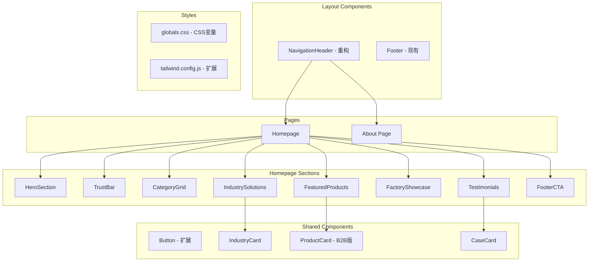

# Design Document: PPE Homepage Redesign

## Overview

本设计文档描述 PPE B2B 电商网站首页重构的技术实现方案。项目基于 Next.js 15 + React 19 + Tailwind CSS + Medusa UI 技术栈，重构现有首页为专业的 B2B PPE 制造商展示页面，包含 8 个核心区块和导航重构。

### 设计目标
- 创建专业的工业风 B2B 网站首页
- 优化 B2B 客户转化路径
- 建立一致的设计系统（CSS 变量）
- 保持与现有 Medusa 商城功能的兼容性

## Architecture



## Components and Interfaces

### 1. CSS 设计系统

**文件**: `storefront/src/styles/globals.css`

```css
:root {
  /* Background Colors */
  --bg-page: #F5F5F5;
  --bg-card: #FFFFFF;
  --bg-dark: #1A1A1A;
  --bg-overlay: rgba(0, 0, 0, 0.6);
  
  /* Accent Colors */
  --accent-primary: #FF8F00;
  --accent-primary-hover: #E68200;
  --accent-secondary: #FFA726;
  
  /* Text Colors */
  --text-primary: #212121;
  --text-secondary: #757575;
  --text-muted: #9E9E9E;
  --text-inverse: #FFFFFF;
  
  /* Border Colors */
  --border-light: #E0E0E0;
  --border-dark: #424242;
  
  /* Font Family */
  --font-heading: 'Montserrat', sans-serif;
}
```

### 2. NavigationHeader 组件重构

**文件**: `storefront/src/modules/layout/templates/nav/index.tsx`

```typescript
interface NavMenuItem {
  label: string
  href: string
  isActive?: boolean
}

// 左侧菜单项
const menuItems: NavMenuItem[] = [
  { label: 'Home', href: '/' },
  { label: 'Product', href: '/store' },
  { label: 'About', href: '/about' },
]
```

### 3. HeroSection 组件

**文件**: `storefront/src/modules/home/components/hero-section/index.tsx`

```typescript
interface HeroSectionProps {
  backgroundImage?: string
  title: string
  subtitle?: string
  primaryCTA: {
    label: string
    href: string
  }
  secondaryCTA: {
    label: string
    onClick: () => void
  }
}
```

### 4. TrustBar 组件

**文件**: `storefront/src/modules/home/components/trust-bar/index.tsx`

```typescript
interface Certification {
  name: string
  logo: string
  alt: string
}

interface TrustBarProps {
  certifications: Certification[]
  partners: Certification[]
}
```

### 5. CategoryGrid 组件

**文件**: `storefront/src/modules/home/components/category-grid/index.tsx`

```typescript
interface CategoryItem {
  id: string
  name: string
  image: string
  href: string
  size: 'large' | 'medium' | 'small'
  subcategories?: string[]
  productCount?: number
}

interface CategoryGridProps {
  categories: CategoryItem[]
}
```

### 6. IndustrySolutions 组件

**文件**: `storefront/src/modules/home/components/industry-solutions/index.tsx`

```typescript
interface IndustryProduct {
  name: string
  description: string
  image: string
}

interface Industry {
  id: string
  name: string
  icon: string
  products: IndustryProduct[]
}

interface IndustrySolutionsProps {
  title: string
  industries: Industry[]
}
```

### 7. FeaturedProducts 组件（B2B 版）

**文件**: `storefront/src/modules/home/components/featured-products-b2b/index.tsx`

```typescript
interface ProductSpec {
  icon: string
  label: string
  value: string
}

interface FeaturedProduct {
  id: string
  name: string
  image: string
  label?: 'Best Seller' | 'New Arrival'
  specs: ProductSpec[]
  href: string
}

interface FeaturedProductsB2BProps {
  products: FeaturedProduct[]
}
```

### 8. FactoryShowcase 组件

**文件**: `storefront/src/modules/home/components/factory-showcase/index.tsx`

```typescript
interface FactoryCapability {
  icon: string
  title: string
  description: string
}

interface FactoryShowcaseProps {
  images: string[]
  capabilities: FactoryCapability[]
  capacity: string
  leadTimeStock: string
  leadTimeCustom: string
}
```

### 9. Testimonials 组件

**文件**: `storefront/src/modules/home/components/testimonials/index.tsx`

```typescript
interface CaseStudy {
  id: string
  image: string
  title: string
  quantity: string
  location: string
  year: string
}

interface TestimonialsProps {
  title: string
  cases: CaseStudy[]
}
```

### 10. FooterCTA 组件

**文件**: `storefront/src/modules/home/components/footer-cta/index.tsx`

```typescript
interface ContactInfo {
  whatsapp: string
  email: string
  address: string
}

interface FooterCTAProps {
  title: string
  subtitle?: string
  contactInfo: ContactInfo
  onEmailSubmit: (email: string) => Promise<void>
}
```

### 11. About 页面

**文件**: `storefront/src/app/[countryCode]/(main)/about/page.tsx`

简单的企业介绍页面，包含公司简介、使命愿景等占位内容。

## Data Models

### 静态数据配置

由于这是一个展示型首页，大部分数据为静态配置：

```typescript
// storefront/src/lib/config/homepage.ts

export const homepageConfig = {
  hero: {
    title: "Professional PPE Manufacturer for Extreme Environments",
    backgroundImage: "/account-block.jpg",
    primaryCTA: { label: "View Catalog", href: "/store" },
    secondaryCTA: { label: "Request A Quote" }
  },
  
  certifications: [
    { name: "CE", logo: "/account-block.jpg", alt: "CE Certification" },
    { name: "ANSI", logo: "/account-block.jpg", alt: "ANSI Certification" },
    { name: "ISO9001", logo: "/account-block.jpg", alt: "ISO9001 Certification" },
    { name: "EN388", logo: "/account-block.jpg", alt: "EN388 Certification" }
  ],
  
  categories: [
    { id: "gloves", name: "Safety Gloves", size: "large", subcategories: ["Cut Resistant", "Chemical"] },
    { id: "shoes", name: "Safety Shoes", size: "medium" },
    { id: "workwear", name: "Workwear", size: "medium" },
    { id: "eye", name: "Eye Protection", size: "small" },
    { id: "helmets", name: "Helmets", size: "small" }
  ],
  
  industries: [
    { id: "construction", name: "Construction", products: [...] },
    { id: "oil-gas", name: "Oil & Gas", products: [...] },
    { id: "chemical", name: "Chemical", products: [...] }
  ],
  
  factory: {
    capacity: "500,000 pairs monthly",
    leadTimeStock: "3 days",
    leadTimeCustom: "20 days",
    capabilities: [
      { title: "Logo Printing", description: "Custom logo printing on products" },
      { title: "Packaging", description: "Custom packaging solutions" }
    ]
  },
  
  contact: {
    whatsapp: "+86 XXX XXXX XXXX",
    email: "sales@example.com",
    address: "123 Industrial Zone, City, Country"
  }
}
```

## Correctness Properties

*A property is a characteristic or behavior that should hold true across all valid executions of a system-essentially, a formal statement about what the system should do. Properties serve as the bridge between human-readable specifications and machine-verifiable correctness guarantees.*

基于 prework 分析，以下是可测试的正确性属性：

### Property 1: Product Card Label Position
*For any* product card that has a label (Best Seller or New Arrival), the label element SHALL be positioned in the top-left corner of the card.
**Validates: Requirements 8.2**

### Property 2: Product Card Specifications Display
*For any* product card with specifications data, all specification values SHALL be visible on the rendered card.
**Validates: Requirements 8.3**

### Property 3: Product Card Button Text
*For any* product card rendered in the featured products section, the action button text SHALL be "Inquire Now".
**Validates: Requirements 8.4**

### Property 4: Case Study Card Content
*For any* case study card rendered in the testimonials section, the card SHALL display both quantity supplied and project location information.
**Validates: Requirements 10.2**

### Property 5: Placeholder Image Usage
*For any* image component in the homepage sections, the image source SHALL be "/account-block.jpg" until final images are provided.
**Validates: Requirements 12.1**

## Error Handling

### 图片加载失败
- 使用 Next.js Image 组件的 `onError` 回调
- 显示占位符背景色或默认图片

### 表单提交错误
- FooterCTA 邮箱提交失败时显示错误提示
- 使用 try-catch 包装异步操作

### 导航错误
- 使用 Next.js 的 `notFound()` 处理无效路由
- About 页面不存在时显示 404

## Testing Strategy

### 单元测试

使用 Jest + React Testing Library 进行组件测试：

1. **NavigationHeader 测试**
   - 验证菜单项渲染
   - 验证导航链接正确性

2. **HeroSection 测试**
   - 验证标题文本渲染
   - 验证 CTA 按钮渲染

3. **CategoryGrid 测试**
   - 验证所有分类项渲染
   - 验证 Bento Grid 布局结构

### 属性测试

使用 fast-check 进行属性测试：

1. **Property 1: Product Card Label Position**
   - 生成随机产品数据（带/不带标签）
   - 验证标签位置 CSS 类

2. **Property 2: Product Card Specifications Display**
   - 生成随机规格数据
   - 验证所有规格值在 DOM 中可见

3. **Property 3: Product Card Button Text**
   - 生成随机产品卡片
   - 验证按钮文本始终为 "Inquire Now"

4. **Property 4: Case Study Card Content**
   - 生成随机案例数据
   - 验证数量和位置信息存在

5. **Property 5: Placeholder Image Usage**
   - 遍历所有图片组件
   - 验证 src 属性为占位符路径

### 测试配置

```javascript
// jest.config.js 扩展
module.exports = {
  // ... existing config
  testMatch: ['**/__tests__/**/*.test.ts?(x)'],
  setupFilesAfterEnv: ['<rootDir>/jest.setup.js']
}
```

### 属性测试库

使用 `fast-check` 作为属性测试库：

```bash
yarn add -D fast-check @testing-library/react @testing-library/jest-dom
```
