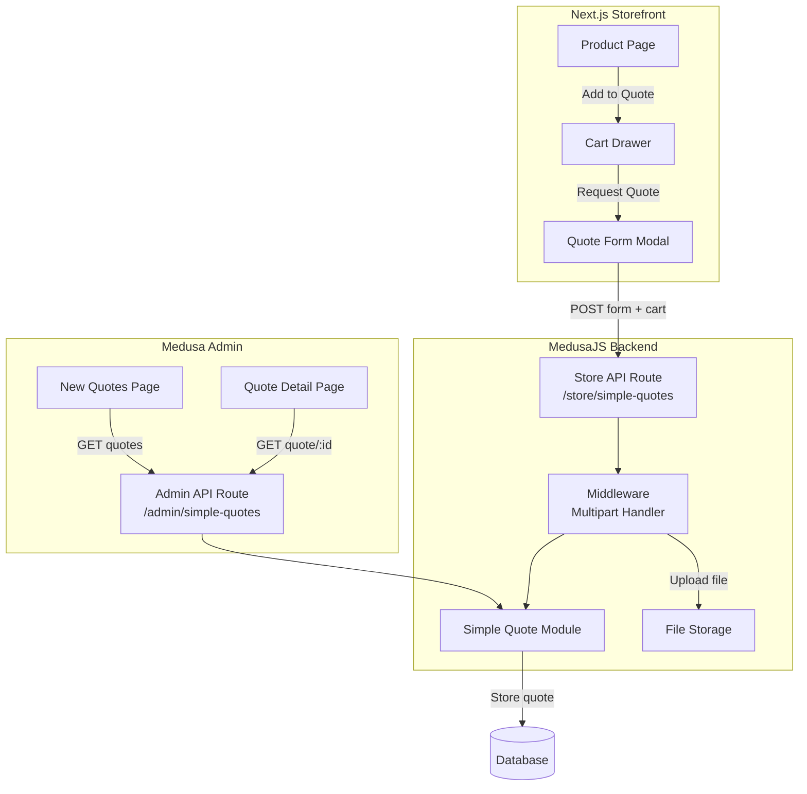

# Design Document: Simple Quote System

## Overview

The Simple Quote system is a custom MedusaJS v2 module that enables guest users to submit quote requests containing their contact information and cart items. The system operates independently from the native Quote Module, providing a streamlined workflow for B2B quote inquiries.

The architecture follows MedusaJS v2 patterns with a custom module for data persistence, Store API routes for guest submissions, and Admin UI extensions for quote management.

## Architecture



## Components and Interfaces

### Backend Components

#### 1. Simple Quote Module (`backend/src/modules/simple-quote`)

```typescript
// Module registration
export const SIMPLE_QUOTE_MODULE = "simpleQuote";

// Service interface
interface SimpleQuoteModuleService {
  createSimpleQuotes(data: CreateSimpleQuoteDTO[]): Promise<SimpleQuote[]>;
  listSimpleQuotes(filters?: FilterableSimpleQuoteProps, config?: FindConfig): Promise<SimpleQuote[]>;
  retrieveSimpleQuote(id: string, config?: FindConfig): Promise<SimpleQuote>;
  listAndCountSimpleQuotes(filters?: FilterableSimpleQuoteProps, config?: FindConfig): Promise<[SimpleQuote[], number]>;
}
```

#### 2. Store API Route (`backend/src/api/store/simple-quotes`)

```typescript
// POST /store/simple-quotes
interface CreateSimpleQuoteRequest {
  name: string;
  email: string;
  contact_info: string;
  company_name?: string;
  remark?: string;
  file?: File;
  cart_items: CartItemDTO[];
}

interface CreateSimpleQuoteResponse {
  simple_quote: SimpleQuote;
}
```

#### 3. Admin API Routes (`backend/src/api/admin/simple-quotes`)

```typescript
// GET /admin/simple-quotes
interface ListSimpleQuotesResponse {
  simple_quotes: SimpleQuote[];
  count: number;
  offset: number;
  limit: number;
}

// GET /admin/simple-quotes/:id
interface GetSimpleQuoteResponse {
  simple_quote: SimpleQuote;
}
```

### Storefront Components

#### 1. Quote Form Modal (`storefront/src/modules/quotes/components/quote-form-modal`)

```typescript
interface QuoteFormModalProps {
  isOpen: boolean;
  onClose: () => void;
  cart: StoreCart;
  onSuccess: () => void;
}

interface QuoteFormData {
  name: string;
  email: string;
  contact_info: string;
  company_name?: string;
  remark?: string;
  file?: File;
}
```

#### 2. Modified Cart Drawer

The existing CartDrawer component will be modified to:
- Hide "View Cart" and "Secure Checkout" buttons
- Display a single "Request Quote" button
- Open QuoteFormModal on button click

#### 3. Modified Product Components

- ProductPrice: Add "Reference Price" label
- ProductVariantsTable: Change button text to "Add to Quote"

### Admin Components

#### 1. Simple Quotes List Page (`backend/src/admin/routes/simple-quotes/page.tsx`)

```typescript
// Table columns: name, email, company_name, created_at
// Row click navigates to detail page
```

#### 2. Simple Quote Detail Page (`backend/src/admin/routes/simple-quotes/[id]/page.tsx`)

```typescript
// Displays: customer info, cart items list, file download link
```

## Data Models

### SimpleQuote Entity

```typescript
// backend/src/modules/simple-quote/models/simple-quote.ts
const SimpleQuote = model.define("simple_quote", {
  id: model.id({ prefix: "sq" }).primaryKey(),
  name: model.text(),
  email: model.text(),
  contact_info: model.text(),
  company_name: model.text().nullable(),
  remark: model.text().nullable(),
  file_url: model.text().nullable(),
  cart_items: model.json(),
  created_at: model.dateTime(),
  updated_at: model.dateTime(),
});
```

### CartItemDTO (JSON structure stored in cart_items)

```typescript
interface CartItemDTO {
  variant_id: string;
  product_id: string;
  product_title: string;
  variant_title: string;
  variant_sku?: string;
  quantity: number;
  unit_price?: number;
  thumbnail?: string;
}
```


## Correctness Properties

*A property is a characteristic or behavior that should hold true across all valid executions of a system-essentially, a formal statement about what the system should do. Properties serve as the bridge between human-readable specifications and machine-verifiable correctness guarantees.*

### Property 1: Quote creation stores all provided fields correctly

*For any* valid quote submission containing name, email, contact_info, and cart_items (with optional company_name, remark, file_url), the created quote record SHALL contain all provided field values exactly as submitted.

**Validates: Requirements 1.1, 1.5**

### Property 2: Required field validation rejects incomplete requests

*For any* quote request missing any required field (name, email, or contact_info), the Store API SHALL reject the request with a 400 status code and not create a quote record.

**Validates: Requirements 1.2, 1.3, 1.4**

### Property 3: File upload processing and URL storage

*For any* quote submission with a file attachment, the system SHALL store the file and populate the file_url field; for submissions without a file, file_url SHALL be null.

**Validates: Requirements 2.1, 2.2, 2.3**

### Property 4: Form validation prevents submission without required fields

*For any* form submission attempt where any required field (name, email, contact_info) is empty or whitespace-only, the form SHALL display validation errors and prevent the API call.

**Validates: Requirements 5.2**

### Property 5: Form submission sends correct data structure

*For any* valid form submission, the data sent to POST /store/simple-quotes SHALL include all form fields and the complete cart_items array matching the current cart state.

**Validates: Requirements 5.3**

## Error Handling

### API Error Responses

| Error Condition | HTTP Status | Response Body |
|----------------|-------------|---------------|
| Missing required field | 400 | `{ "message": "Field '{field}' is required", "type": "invalid_data" }` |
| Invalid email format | 400 | `{ "message": "Invalid email format", "type": "invalid_data" }` |
| File upload failure | 500 | `{ "message": "File upload failed", "type": "server_error" }` |
| Quote not found | 404 | `{ "message": "Simple quote not found", "type": "not_found" }` |

### Frontend Error Handling

- Display inline validation errors for required fields
- Show toast notification for API errors
- Maintain form state on submission failure
- Provide retry capability for network errors

## Testing Strategy

### Property-Based Testing

The project will use **fast-check** as the property-based testing library for TypeScript/JavaScript.

Each property-based test MUST:
- Run a minimum of 100 iterations
- Be tagged with a comment referencing the correctness property: `**Feature: simple-quote, Property {number}: {property_text}**`
- Use smart generators that constrain to valid input spaces

### Unit Testing

Unit tests will cover:
- Module service CRUD operations
- API route handlers
- Form validation logic
- Cart data transformation

### Test File Organization

```
backend/
  src/
    modules/simple-quote/
      __tests__/
        service.test.ts          # Module service unit tests
        service.property.test.ts # Property-based tests for module
    api/store/simple-quotes/
      __tests__/
        route.test.ts            # API route unit tests
        route.property.test.ts   # Property-based tests for API

storefront/
  src/
    modules/quotes/
      __tests__/
        quote-form-modal.test.tsx    # Form component tests
        quote-form.property.test.ts  # Property-based validation tests
```
